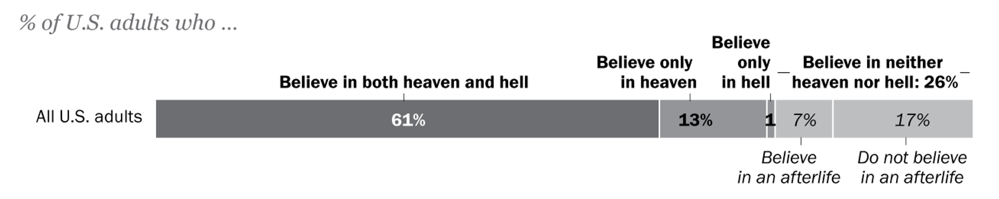
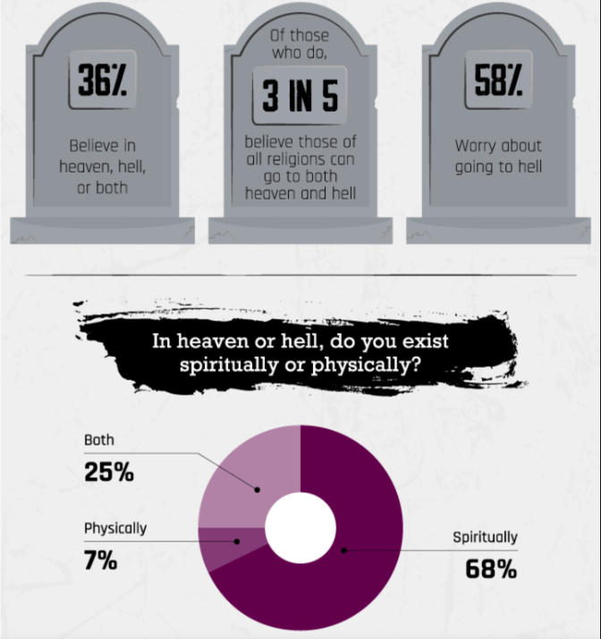

```{r setup, include=FALSE}
knitr::opts_chunk$set(echo = FALSE)
```

class: huge center inverse subsection
<br>
# What happens after we die?

---
# Pew Research Survey 2021

```{r, echo = FALSE, out.width = '95%'}

```

.smaller[
Source article: [Pew Research 2021](https://www.pewresearch.org/fact-tank/2021/11/23/republicans-more-likely-than-democrats-to-believe-in-heaven-say-only-their-faith-leads-there/)
]

---
## Spiritshack Survey 2022 (UK)

```{r, echo = FALSE, out.width = '45%', fig.align='center'}

```

.smaller[Source: [Spritishack.co.uk survey](https://www.spiritshack.co.uk/blog/what-the-uk-believes-about-the-afterlife/  )]

---
## [Apostles' Creed](https://www.crcna.org/welcome/beliefs/creeds/apostles-creed)

.small[
.pull-left[
I believe in God, the Father almighty, <br>
      creator of heaven and earth.<br>
I believe in Jesus Christ, his only Son, our Lord,<br>
      who was conceived by the Holy Spirit <br>
      and born of the virgin Mary.<br>
      He suffered under Pontius Pilate,<br>
      was crucified, died, and was buried;<br>
      he descended to hell.<br>
      The third day he rose again from the dead.<br>
]

.pull-right[
      He ascended to heaven<br>
      and is seated at the right hand of God the Father almighty.<br>
      From there he will come to judge the living and the dead.<br>
I believe in the Holy Spirit,<br>
      the holy catholic church,<br>
      the communion of saints,<br>
      the forgiveness of sins,<br>
      the resurrection of the body,<br>
      and the life everlasting. Amen.
]
]
---
## Matthew 6:7-13

.smaller[
And when you pray, do not keep on babbling like pagans, for they think they will be heard because of their many words. Do not be like them, for your Father knows what you need before you ask him. This, then, is how you should pray:<br>
]
.small[
‘Our Father in heaven,<br>
hallowed be your name,<br>
your kingdom come,<br>
your will be done,<br>
    on earth as it is in heaven.<br>
Give us today our daily bread.<br>
And forgive us our debts,<br>
    as we also have forgiven our debtors.<br>
And lead us not into temptation,<br>
    but deliver us from the evil one.’ <br>
    ]

---

class: huge center inverse subsection
<br>
# What happens after we die?

#### (and what/where exactly is "heaven"?)
#### (free write 5:00)

---
## Wright, p. 29 - 30

>> The ultimate future hope remains a surprise, partly because we don't know when it will arrive and partly because at present we have only images and metaphors for it, leaving us to guess that the reality will be far greater, and more surprising, still

.small[
Avoid a "lapse into a kind of collusion with entropy, acquiescing...that things may be getting worse but there's nothing much we can do about them"]

---

class: huge center inverse subsection
<br>
## Creation / Fall / Redemption
<br>
## Wonder / Heartbreak / Hope

---
class: huge center inverse subsection
<br>
# How does CFR fit into [Reformed theology?](https://stacyderuiter.github.io/core100-2024/day2-what-is-reformed.pdf)

[Genesis 1: 26-27](https://www.biblegateway.com/passage/?search=Genesis%201%3A26-27&version=VOICE)
[Colossians 1:15-20](https://www.biblegateway.com/passage/?search=Colossians%201%3A15-20&version=NTE)

---
class: huge center inverse subsection
<br>
>>God the Father has reconciled his created but fallen world through the death of his Son, and renews it into a Kingdom of God by his Spirit. -Herman Bavinck

---
## Group Conversations

* Define/discuss Creation *or* Fall *or* Redemption (Plantinga) *or* Wonder *or* Heartbreak *or* Hope (Strauss)
* Follow-up: Make note of someone's good idea, quote or question *someone else* can share, crediting them by name! 

---
# Sort your Q's

* Review the *questions/comments* and *quotes* from your Reading Guides
* Which shed light on C / F / R (or  W / H / H)?
* Which address, "Why ES / D&D / GR&C"?

---
class: huge center inverse subsection
<br>
# Why ES / D&D / GRC?

(From Plantinga, Strauss, SoS, FEN)
---
# Statement on Sustainability

0. Who is the audience of the SoS - who reads it? How does that affect how it's written?
1. What has changed at Calvin since 2008 (*evidenced* by differences in the SoSs?)
2. What in the new SoS is most crucial/resonates?
3. What constructive critique can you offer?


.small[*are you taking notes?*]
---
# Looking Ahead

* Class will consider ES / D&D / GR&C in turn
  * Creation / Wonder
  * Fall / Heartbreak
  * Redemption / Hope
  * Synthesis
* Vocation / Calling

---
## Closing in [prayer](https://www.prayerinstitute.com/prayer/a-prayer-of-appreciation-for-the-beauty-of-gods-creation-2/)
.small[
Holy Spirit, keep us always aware of how we treat the creation. Help us to find the amazement we once had as children when we look at the awesome beauty of our world. Show us, once again, the simple joys of walking barefoot on a sandy beach, playing in the rain, and touching the cool earth with our hands. Remind us to share these joys with others. Help us to make the most of opportunities to experience sanctified times of solitude or companionship while enjoying the peacefulness of nature. Help us to keep the Lord’s commandments to preserve the earth and care for all that is in it. Teach us to regularly do our part to respect and protect all living creatures as an act of love and gratitude to our Heavenly Father.
]