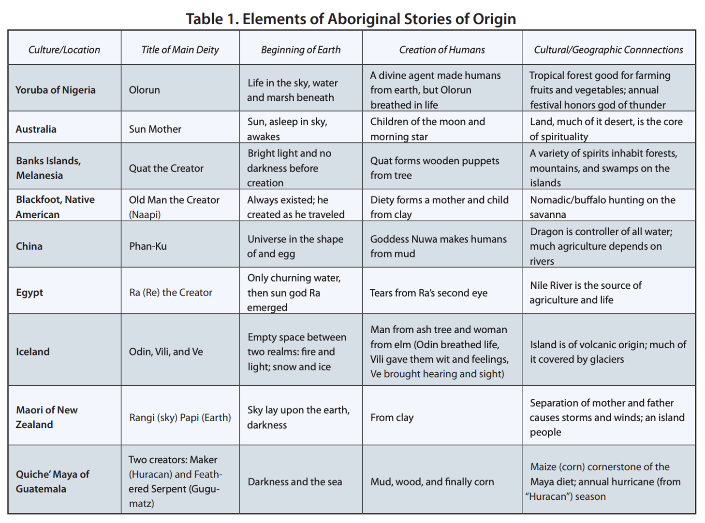

```{r setup, include=FALSE}
knitr::opts_chunk$set(echo = FALSE)
```

class: huge center inverse subsection

<br>
# Humans: are we mostly **good** or mostly **bad**?
<br>
#### Use one sticker to show your answer.

---

## Scripture of Day: Genesis 1:27-28

So God created human beings in his image. In the image of God he created them. He created them male and female. God blessed them and said, “Have many children and grow in number. Fill the earth and be its master. Rule over the fish in the sea and over the birds in the sky. Rule over every living thing that moves on the earth.”

---

## Scripture of Day: Colossians 1:15-17 

.small[
The Son is the image of the invisible God, the firstborn over all creation. For in him all things were created: things in heaven and on earth, visible and invisible, whether thrones or powers or rulers or authorities; all things have been created through him and for him. He is before all things, and in him all things hold together.
]

---
# [Reformed Christian Theological Concepts](https://stacyderuiter.github.io/core100-fa24/day2-what-is-reformed.pdf)

# Common Grace
# Image of God

---
## Robin Wall Kimmerer (contemporary)
### Writer (essays, memoir); Botanist

```{r, echo = FALSE, out.width='50%', fig.align='center'}
knitr::include_graphics('https://encrypted-tbn1.gstatic.com/images?q=tbn:ANd9GcSgxT3Mfy1gby-McWjLRSfL8Nz-XNmrkJitrvZd_8_QfFd0VnG9')
```

.smaller[Image: <https://www.theguardian.com/books/2020/may/23/all>]

---
## Aminah Al-Attas Bradford (contemporary)
## Ecologist, scholar of Christian thought

```{r, echo = FALSE, out.width='40%', fig.align='center'}
knitr::include_graphics('https://cals.ncsu.edu/applied-ecology/wp-content/uploads/sites/4/2021/02/Aminah-Al-Attas-Bradford-1.jpeg')
```

.smaller[Image: <https://cals.ncsu.edu/applied-ecology/people/aminah-al-attas-bradford>]

---

## Symbiotic Stewardship
### Al-Attas Bradford 

.small[
1. Are you surprised by the deep integration of humans and microbes? How easily (or not easily) does this idea sit with you? For example, what is your reaction to the term *holobiont*?
2. Where do humans fit in to creation, and what does it mean to be created "in the image of God," according to Al-Attas Bradford? What unconventional insights does she add, and do they resonate with you?
3. ??? (*Your questions*)
]

---
--- 

## A Third Story

<iframe frameborder="0" scrolling="yes" style="border:0px" src="https://books.google.com/books?id=vmM9BAAAQBAJ&newbks=0&lpg=PA341&dq=It%20is%20said%20that%20in%20the%20beginning%20there%20was%20emptiness.%20The%20divine%20beings%2C%20the%20great%20thinkers%2C%20imagined%20the%20world%20into%20existence%20simply%20by%20saying%20its%20name.%20The%20world%20was%20populated%20with%20rich%20flora%20and%20fauna%2C%20called%20into%20being%20by%20words.%20But%20the%20divine%20beings%20were%20not%20satisfied.%20Among%20the%20wonderful%20beings%20they%20had%20created%2C%20none%20were%20articulate.%20T&pg=PA341&output=embed" width=1200 height=400></iframe>

.smaller[
[“People of Corn, People of Light”](https://books.google.com/books?id=vmM9BAAAQBAJ&lpg=PA341&dq=It%20is%20said%20that%20in%20the%20beginning%20there%20was%20emptiness.%20The%20divine%20beings%2C%20the%20great%20thinkers%2C%20imagined%20the%20world%20into%20existence%20simply%20by%20saying%20its%20name.%20The%20world%20was%20populated%20with%20rich%20flora%20and%20fauna%2C%20called%20into%20being%20by%20words.%20But%20the%20divine%20beings%20were%20not%20satisfied.%20Among%20the%20wonderful%20beings%20they%20had%20created%2C%20none%20were%20articulate.%20T&pg=PA344#v=onepage&q&f=false) in Braiding Sweetgrass, p. 341
]
---

# Creation Stories:

.pull-left[
# Questions
## Where do I come from?
## Why am I here?
## Who am I?
]
.pull-right[
# *Tasks*
## *Giving meaning to existence*
## *Define moral codes, band societies together*
]

.smaller[
<https://www.socialstudies.org/system/files/publications/articles/yl_220425.pdf>

]
---
## Themes & Motifs in Creation Stories

.small[
* Animals with human qualities
* Natural elements (sky, earth, water, sun) with human qualities
* Creation out of nothing, chaos, darkness, or water
* Creation of people out of mud or clay
* Separations: humans and animals, mother and father gods, rival gods
* Cycles of creation and destruction
* Connections to the sacred or home places of the culture
]

.smaller[<https://www.socialstudies.org/system/files/publications/articles/yl_220425.pdf>]
---

```{r, echo = FALSE, out.width = '70%', fig.align='center'}

```
.smaller[<https://www.socialstudies.org/system/files/publications/articles/yl_220425.pdf>]
---


```{r, echo = FALSE, out.width = '90%'}

```

---
class: huge center inverse subsection

# Humans are the crown of creation (elders/caretakers), or amidst it, or the lower part (younger/learners)?
---
## Questions: Genesis, Skywoman + People of Corn

* What does a story different from your own draw your attention to or make you notice? 
* What can we learn from examining commonalities and differences?
* **Especially: How do different stories change the way we relate to other living things and inhabit our place on the earth?**

---
# Tying it Together

- What do today's readings teach us about humans being created *in the Image of God*?
- How do they link to each other?
- How do they motivate us in relation to environmental sustainability?

---
<br>
.small[
>>The story of our relationship to the earth is written more truthfully on the land than on the page. It lasts there. The land remembers what we said and what we did. Stories are among our most potent tools for restoring the land as well as our relationship to the land. We need to understand the old stories that live in a place and begin to create new ones, for we are storymakers, not just storytellers. [“People of Corn, People of Light”](https://books.google.com/books?id=vmM9BAAAQBAJ&lpg=PA341&dq=It%20is%20said%20that%20in%20the%20beginning%20there%20was%20emptiness.%20The%20divine%20beings%2C%20the%20great%20thinkers%2C%20imagined%20the%20world%20into%20existence%20simply%20by%20saying%20its%20name.%20The%20world%20was%20populated%20with%20rich%20flora%20and%20fauna%2C%20called%20into%20being%20by%20words.%20But%20the%20divine%20beings%20were%20not%20satisfied.%20Among%20the%20wonderful%20beings%20they%20had%20created%2C%20none%20were%20articulate.%20T&pg=PA344#v=onepage&q&f=false) in Braiding Sweetgrass, p. 341
]