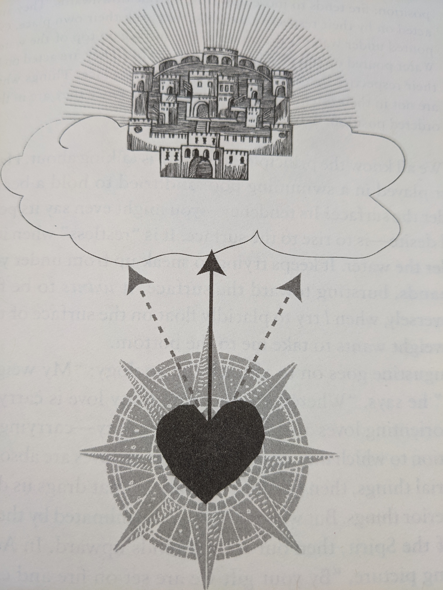

class: bigger
```{r setup, include=FALSE}
knitr::opts_chunk$set(echo = FALSE)
```

# Today...

1. Smith
2. Poems
3. Final Dialog

---

## Today...
### 1. *You are what you love*
### Jamie Smith (philosopher, contemporary)

```{r, echo = FALSE, out.width='35%', fig.align='center'}
knitr::include_graphics('https://calvin.edu/sites/default/files/styles/card_person/public/images/people/https/calvin.edu/dA/c0023d11-532a-461e-8acf-f45dccbdc73b/binaryimage/jkas%20original%20web%20pic.jpeg?itok=g5er8OHB')
```


---
class: huge center inverse subsection
<br>
# Above all else, guard your heart, for everything you do flows from it. 
#(Proverbs 4:23)

---
# Philippians 1:9-11
And this is my prayer: That your love may abound more and more in knowledge and depth of insight, so that you may be able to discern what  is best and may be pure and blameless for the day of Christ, filled with the fruit of righteousness that comes through Jesus Christ - to the Glory and Praise of God. 

---
# Loves

- What  does Smith mean when he speaks about our "loves" (ends, *telos*, desires)?
- Which previous thinker(s) does Smith credit for these ideas?

---
## "Part Engine & Part Homing Beacon"
### What does the sketch mean?

```{r, echo = FALSE, out.width = '40%', fig.align='center'}

```

---

class: huge center inverse subsection
<br>
# Consider:
# What do you [have to; want to; need to] do *every* day?

---
class: huge center inverse subsection
<br>
# How do your habits orient your heart? What are you "loving" or "worshipping"?

---
# Liturgical Animals

- What would Smith have to say to a Christian who said they were a faithful believer, but never attended church?
- What does Smith's idea of people as "liturgical animals" have to do with it?
- Which example or quote from Smith resonates most -- or does *not*?

---
# Today...
### 2. Poems
### Aimee Nezhukumatathil, Ross Gay, Emily Dickinson


```{r, echo = FALSE, out.width='32%', fig.show='hold'}
knitr::include_graphics('https://static1.squarespace.com/static/626084498ec1967954b18066/t/62a287ffd71ae47ca47ca404/1654818829217/Ross+Gay+Photo+by+Natasha+Komoda+2.jpg')
knitr::include_graphics('https://cdn-test.poetryfoundation.org/cdn-cgi/image/w=2292,q=80/content/images/16019bc1df0e0de2ff65dffbeccfd58923bae1a6.jpeg')
knitr::include_graphics('https://facts.net/wp-content/uploads/2023/05/emily-dickinson-life--730x487.jpg')
```

.smaller[Photos from: <https://facts.net/emily-dickinson-facts/>, <https://www.rossgay.net/about> <https://media.poetryfoundation.org>]

---

<iframe width="1120" height="630" src="https://www.youtube.com/embed/YUe4k9mL_eU?si=JFDalvF8rwba8DhE" title="YouTube video player" frameborder="0" allow="accelerometer; autoplay; clipboard-write; encrypted-media; gyroscope; picture-in-picture; web-share" allowfullscreen></iframe>

---

<iframe width="1120" height="630" src="https://www.youtube.com/embed/NexB5vAzFWk?si=uQFHi5Jsp3v2twjg" title="YouTube video player" frameborder="0" allow="accelerometer; autoplay; clipboard-write; encrypted-media; gyroscope; picture-in-picture; web-share" allowfullscreen></iframe>


---
## This World is not conclusion (by Emily Dickinson)

.small[
.pull-left[
This World is not Conclusion.<br>
A Species stands beyond - <br>
Invisible, as Music - <br>
But positive, as Sound -<br>
It beckons, and it baffles -<br> 
Philosophy, don't know - <br>
And through a Riddle, at the last -<br> 
Sagacity, must go -<br>
To guess it, puzzles scholars -<br>
To gain it, Men have borne<br>

]

.pull-right[
Contempt of Generations<br>
And Crucifixion, shown -<br>
Faith slips - and laughs, and rallies - <br>
Blushes, if any see - <br>
Plucks at a twig of Evidence - <br> 
And asks a Vane, the way - <br>
Much Gesture, from the Pulpit -<br>
Strong Hallelujahs roll - <br>
Narcotics cannot still the Tooth <br>
That nibbles at the soul - <br>
]
]

---
## Discussion Ideas

.smaller[
- Ross Gay reviewed Nezhukumatathil's *World of Wonders*, saying: "Sometimes we need teachers who remind us how to be flabbergasted and flummoxed and enswooned by the wonders of this earth. How to be in stupefied and devotional love to the wonders of this earth. How to be in love with this, our beloved earth...This book enraptures with its own astonishments and reveries while showing us how to be enraptured, how to revere." How do you respond? How might Smith? Wright? Kimmerer? Other course authors?
- But...Where in Aimee Nezhukumatathil's "Superb bird of paradise," or in "Sorrow is not my name," can you see a glimpse of the new creation as Wright envisions it, or the City of God as Augustine describes it, or righteous "loves" as Smith describes them? Support your argument with appropriate quotes or citations.
- What connections can you draw between Dickinson and the other poems? Dickinson, and Smith/Augustine/Wright/Plantinga's ideas about humans' loves and deep desires? 
- Any other connections to course materials apparent? Other ways the poems moved, surprised, or confused you?
]

---
class: huge center inverse subsection
<br>
# Course Evaluations

---
class: huge center inverse subsection
<br>
# Final Structured Dialog
## ([Questions on Moodle](https://moodle.calvin.edu/pluginfile.php/2450190/course/section/746337/disability-in-heaven-dialog-2.pdf))
---
<iframe width="1120" height="630" src="https://www.youtube.com/embed/eIE1kYqfKhE?si=iB-k-3q8PX4e6KvB" title="YouTube video player" frameborder="0" allow="accelerometer; autoplay; clipboard-write; encrypted-media; gyroscope; picture-in-picture; web-share" referrerpolicy="strict-origin-when-cross-origin" allowfullscreen></iframe>
