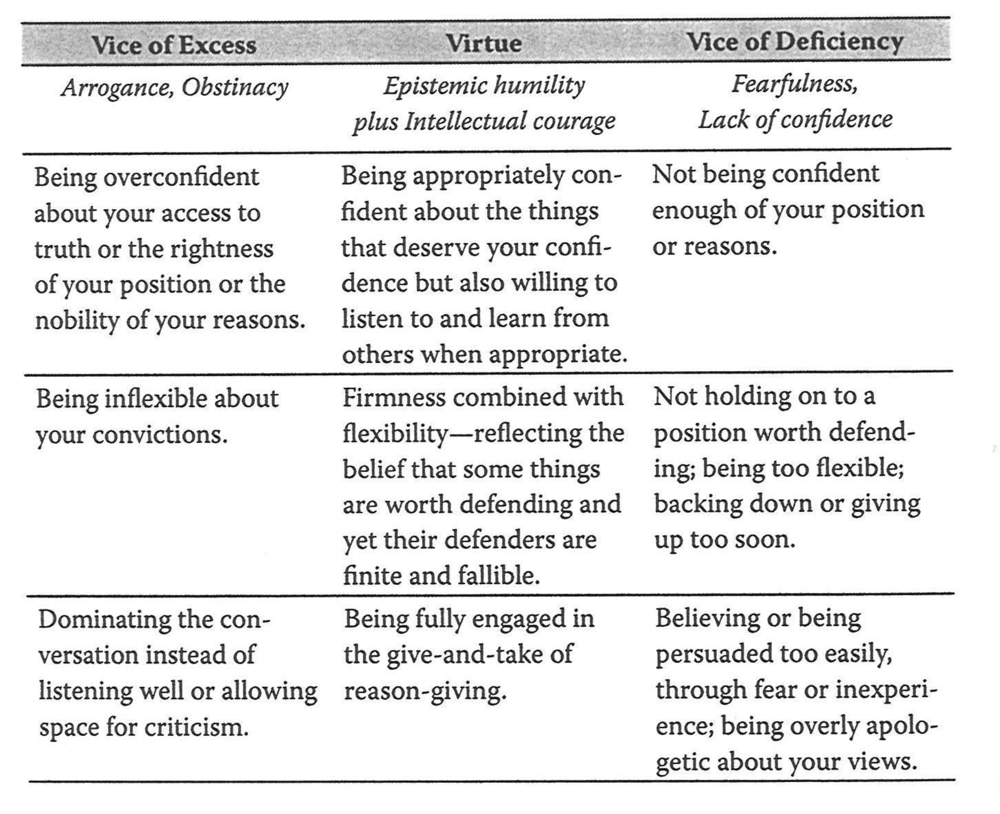

class: bigger
```{r setup, include=FALSE}
knitr::opts_chunk$set(echo = FALSE)
```


# Welcome!

- Choose a seat...*WISELY*!
- Everyone should match the statement on the paper on their desk
- Keep that seat for a while

---
class: bigger

# Seating Chart

- Everyone: Your name, your fact (and anything else you'd like to say)
- This is a one-time thing - thanks for your patience!

---
class: bigger

# Logistics

- Meet in HH 331 Tu/Th at 11:00
- If sick, in isolation, other stuff: get in touch and I'll try to help
- All info is on: <https://moodle.calvin.edu/>

---
## I Corinthians 8:1-3

>> Now regarding your question about food that has been offered to idols. Yes, we know that "we all have knowledge" about this issue. But while knowledge makes us feel important, it is love that strengthens the church. Anyone who claims to know all the answers doesn’t really know very much. But the person who loves God is the one whom God recognizes.

---
class: small

## Ready to learn...what?

>>This course serves as an invitation to a Christian liberal arts education that equips students for vocation and citizenship. Topics include exploration of Calvin’s Reformed Christian tradition and its commitments to justice, intercultural learning, and environmental sustainability. Normally taken in a student’s first semester at Calvin, this reading- and discussion-based course helps students develop and practice skills required to succeed as a university student. 

---

# In other words...

- WELCOME to Calvin
- Belonging at Calvin
- Understanding the Calvin project
- Prep for college & lifelong learning in community

---
# [What's CORE 100 All About?](https://docs.google.com/presentation/d/1E6i7Ni_zzJjfg9VQohgJ7ocyKq32mSCUjBubIyi2yuA/edit?usp=sharing) 

*Thanks to Prof. Jane Zwart for slide deck*

---
# Today's material from:

## Rebecca Konyndyk De Young et al., "The Ethics of Argument" from *The Little Book of Logic.* CORE 100 Reader pp. 57-66 (old: 267 - 201).

---
# Course Learning Outcome:

>>Employ strategies for hospitable engagement across difference.

* *How* can we learn and embody this?

---

# What's the point?

>>we often slide into the conviction that the main point of reasoning with others is personal vindication. The  aim is to prove that we were right all along and that others, in daring to  oppose us, are just plain wrong (De Young et al., p. 58).

---
# What's the point?

>> Here we want to remind ourselves of the  primary purpose...the desire for truth and understanding. Wisdom is something we may have  in part. But in many areas we remain properly perplexed; in other areas we may be quite sure of ourselves but entirely wrong (De Young et al., p. 58). 

---
# What's the point?

>>Reviewing reasons and evaluating arguments is one way to correct our errors and acquire a deeper and more complete understanding of ourselves and the world around us. It's all about acquiring wisdom (De Young et al., p. 58).

---
# Power or Gratitude?

Is knowledge power, or is knowledge "best seen as a gift" (DeYoung et al. p. 59)?

Is argumentation best done "in attack mode" that is "combative, competitive" (DeYoung et al. p. 58)? Or "in humility, gratitude and good stewardship of what we know and the intellectual gifts by which we come to know it" (DeYoung et al. 59)?

---

## Truth left in the dust

>> In the classroom, in the dorms, on the Internet, or around the dining table, consider how the discussion of controversial topics often goes. These exchanges often degenerate into exercises in disrespect, mutual incomprehension, and intimidating displays of intellectual one-upmanship (De Young et al., p. 59).

---

## Truth left in the dust

>> Positions are misrepresented, persons are attacked, motives are impugned, views are charicatured with loaded words. The conflict takes off under full steam while the common search for truth gets left  in  the dust (De Young et al., p. 59).

 - Can you tell the story of an example? What happened and how did it work out later?
 
---
## The Principle of Charity

>> Treat your partner in dialogue and her arguments as you would want  you and your arguments to be treated. It's the Golden Rule applied to discourse ethics. Philosopher Nicholas Wolterstorff memorably put the point in negative form as a commandment..."Thou must not take cheap shots." (De Young et al., p. 60).

- Can you think of another memorable way to state this principle?

---
## Heard & Understood

.small[
>> Sometimes we are overly dismissive or arrogant in our attitudes toward those who disagree with us. In effect, we're saying, "You're such an idiot! I'm not  even going to bother with what  you have to say!" Wolterstorff once commented that  one reason people do so much yelling in public discourse and arguments over social issues is because they gave their reasons in a calm voice first, but no one listened to them or took them seriously. Their shrill tones of protest were prompted by the dismissive attitudes of their oppoenets. What did these people really want? It's what all of us want: to be heard and understood. To be granted a fair hearing is to be treated with dignity (De Young et al., p. 60). 

]

---
## Heard & Understood

.small[
>> What did these people really want? It's what all of us want: to be heard and understood. To be granted a fair hearing is to be treated with dignity (De Young et al., p. 60).

]

- Can you think of concrete actions you could take or things to say to *avoid* this escalation and better *hear and understand*?
- Is this *always* true? Is there ever a  case where you would *not* want to  give someone a "fair hearing"?

---
## How to do it: Mistakes & Best Practices

.pull-left[
.small[
- Imagine the "best sorts of reasons" someone might hold the view you disagree with
- "Labeling and lumping" -- associate opponents with a certain group that is seen negatively
- Oversimplify the opposing position, or propose a false dichotomy
]]
.pull-right[
.small[
- Emotionally manipulate the conversation
- Try to rank the reasons someone might  hold an opposing view
- Identify values or life experiences that  might lead to an opposing view
- Identify the commitments or values that make it hard for you to sympathize with an  opposing view
]
]

---
## What sort of people are we trying to be?

>> Have the courage to use your intellectual abilities. Even if they are still developing and improving, you have something of real worth to work with (De Young et al. p. 65). [but]...

>>If you already think you're right and can't possibly be wrong, then you have nothing to learn and nowhere to grow. (De Young et al. p. 64).

---

```{r, echo = FALSE, out.width  = '60%', fig.align='center'}

```

.small[De Young et al., page 64]
---
# Course Learning Outcome:

>>Employ strategies for hospitable engagement across difference.

* *How* can we learn and embody this?
---

<iframe width="1020" height="630" src="https://www.youtube.com/embed/5z_gDzQSAOc?si=WsdVJXE4vnkQjG-U" title="YouTube video player" frameborder="0" allow="accelerometer; autoplay; clipboard-write; encrypted-media; gyroscope; picture-in-picture; web-share" referrerpolicy="strict-origin-when-cross-origin" allowfullscreen></iframe>

---
# Some Course Contract Ideas

.small[
- Engage with curiosity and listen to understand. 
- Ask questions!
- Show respect for everyone and look for value in their contributions. 
- Cite others' ideas *by name*.
- Everyone gets a chance to contribute. If speaking comes easy to you, *invite* and *listen*; if not, *listen actively* and *plan to join in.*
- Welcome and encourage diverse perspectives & disagreements.
]

---
class: bigger

# Get in Touch

- Email: stacy.deruiter@calvin.edu
- Teams chat - anytime
- More contact info on Moodle
- [https://bit.ly/meetSDR](https://bit.ly/meetSDR)

---
class: bigger

# Assignments

.small[
- Student survey today (or ASAP)
- Read/watch/listen (then **show up** in class) starting Friday
- Reading notes starting Friday
- Two papers (around mid-term and near end); Structured dialogues
]

---
class: bigger

# Course Questions?
 - stacy.deruiter@calvin.edu
 - moodle.calvin.edu -- course page or syllabus
 
## Other Help
.small[
- <https://calvin.edu/offices-services/center-for-student-success/>
- <https://calvin.edu/offices-services/counseling-and-wellness/>
]
